# Mandelbrot Plots
Archive of plots of Mandelbrot Set and Julia Sets generated with [Mandelbrot](https://github.com/gom9000/Mandelbrot/) software.

## Archive Contents

### julia set (low resolution)
Low resolution images (about 1900x1500 pixels) of the 12 Julia sets identified by specific values of complex constant *c*.
Elaboration time was about 5 minutes.

##### Software parameters
<pre>
Mandelbrot.delta = 0.0000001D
Mandelbrot.MAXEMPTYIT= 100
thik = 0.002
</pre>

##### Archive folder
[julia-low-res](julia-low-res)

### julia set (middle resolution)
Middle resolution images (about 3800x3000 pixels) of the 12 Julia sets identified by specific values of complex constant *c*.
Elaboration time was about 23 minutes.

##### Software parameters
<pre>
Mandelbrot.delta = 0.0000001D
Mandelbrot.MAXEMPTYIT= 100
thik = 0.001
</pre>

##### Archive folder
[julia-mid-res](julia-mid-res)

### julia set (hight resolution)
Hight resolution images (about 7600x6000 pixels) of the 12 Julia sets identified by specific values of complex constant *c*.
Elaboration time was about 52 minutes.

##### Software parameters
<pre>
Mandelbrot.delta = 0.0000001D
Mandelbrot.MAXEMPTYIT= 100
thik = 0.0005
</pre>

##### Archive folder
[julia-hi-res](julia-hi-res)

### julia set (very hight resolution)
Very-hight resolution images (about 15000x12000 pixels) of the 12 Julia sets identified by specific values of complex constant *c*.

##### Software parameters
<pre>
Mandelbrot.delta = 0.0000001D
Mandelbrot.MAXEMPTYIT= 100
thik = 0.00025
</pre>

##### Archive folder
[julia-hi2-res](julia-hi2-res)

## File naming format

*set_x_y_x0_y0_thik_c_iterations_colourset.png*

- *set* : julia or mandelbrot set
- *x*, *y* : number of horizontal and vertical pixels of the image
- *x0*, *y0* : coordinates of the center of the image
- *thik* : (step) distance between two near points on the complex plane
- *c* : the value of the complex constant *c* on the formula: *Zn+1 -> Z2n + c*
- *colourset* :
    - 0 - highlights the edges and florescences. Set and "outher" are black, tonescale is proportional to iterations
    - 1 - highlights the set. Set is black and "outher" is white, grayscale is proportional to iterations
    - 2 - highlights the veils and bands. Set and "outher" are black, tonescale is proportional to iterations

## Preview of sets

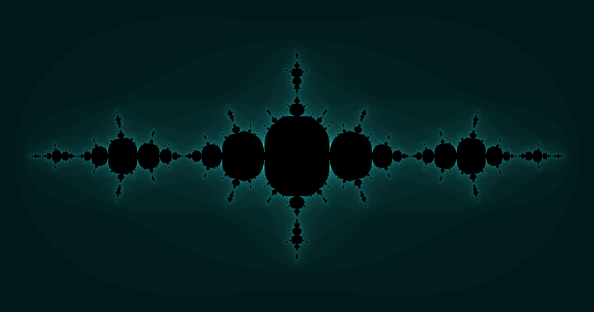

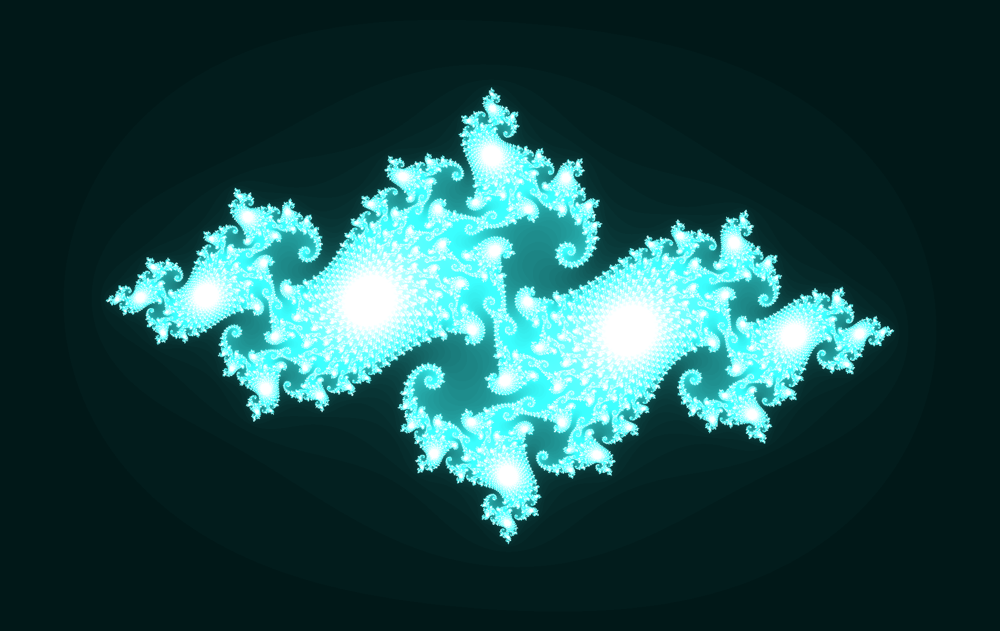

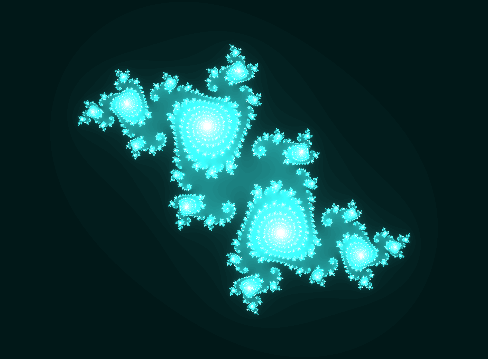

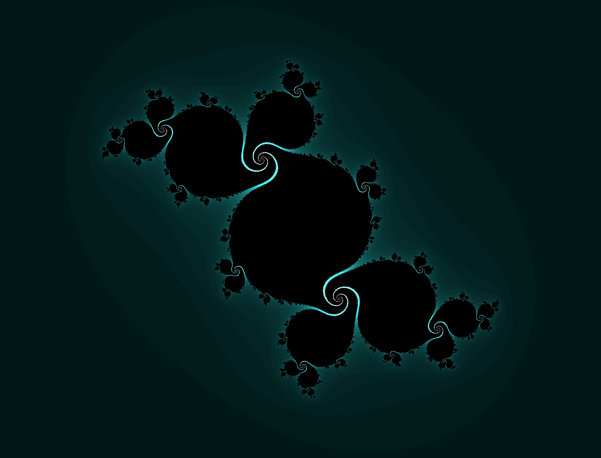

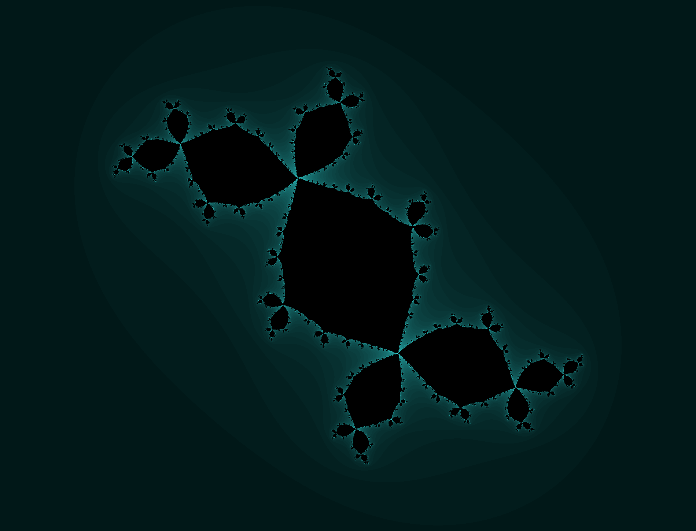

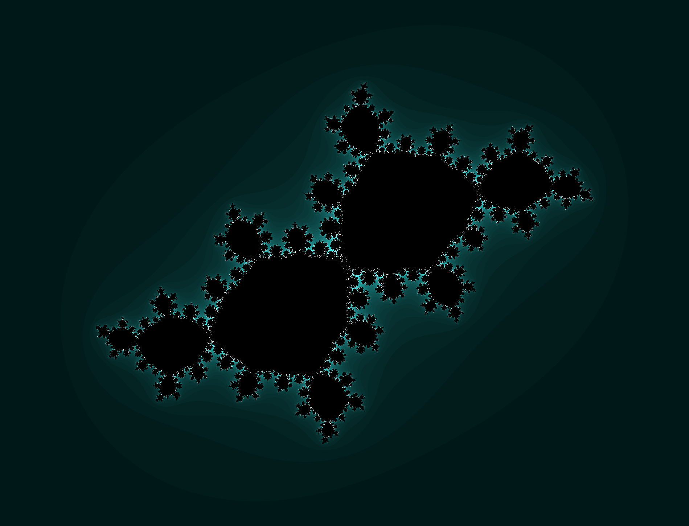

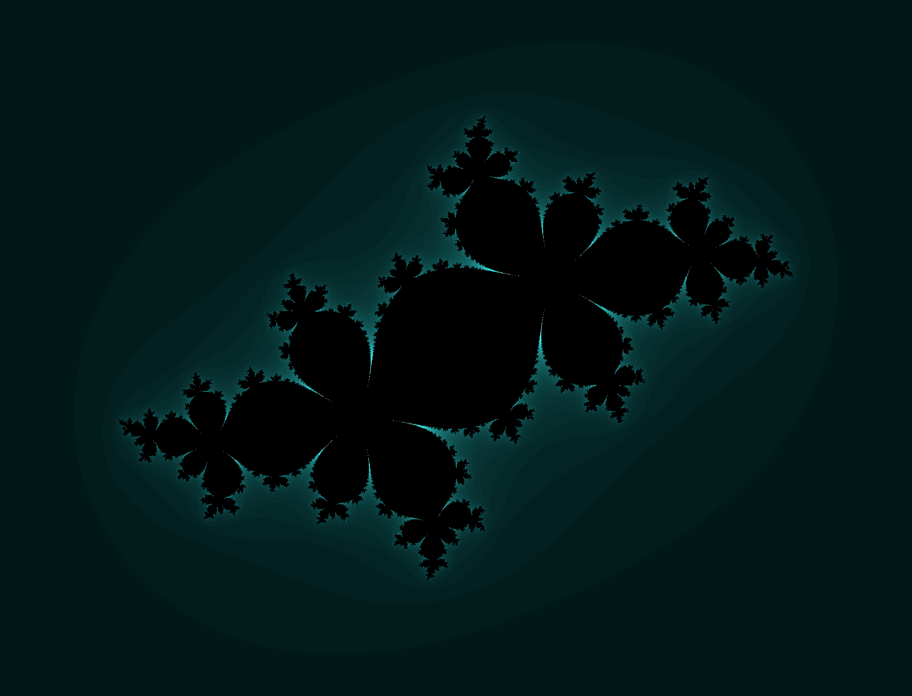

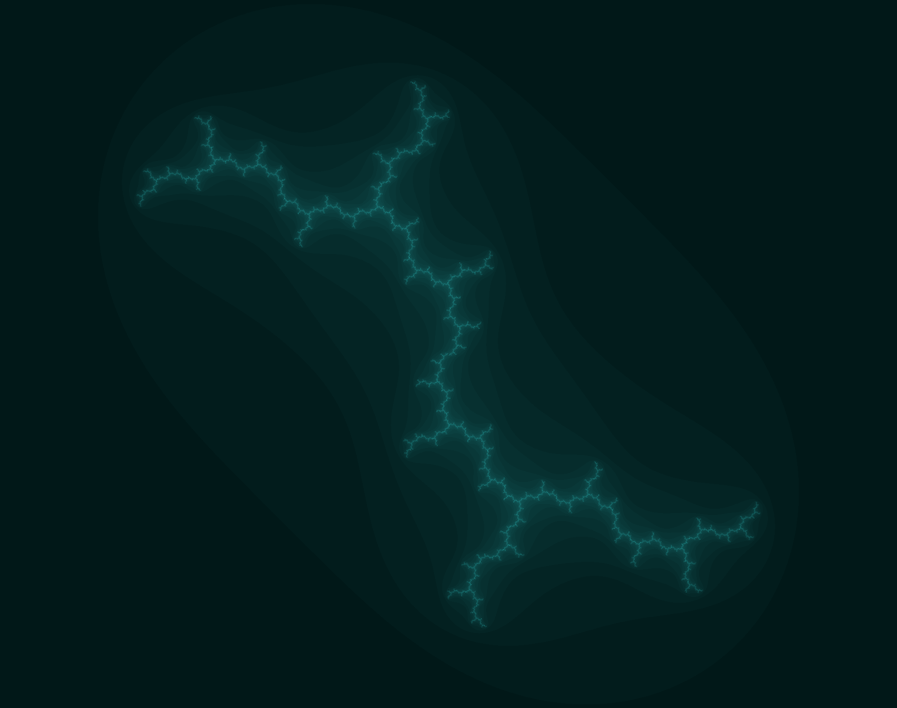

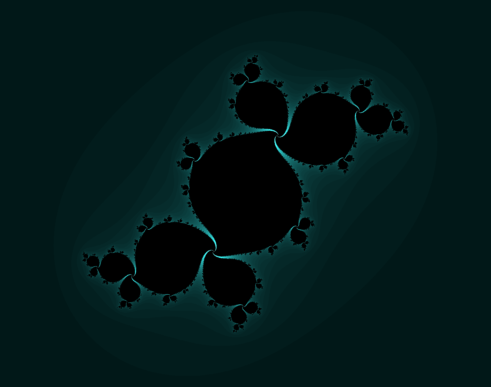

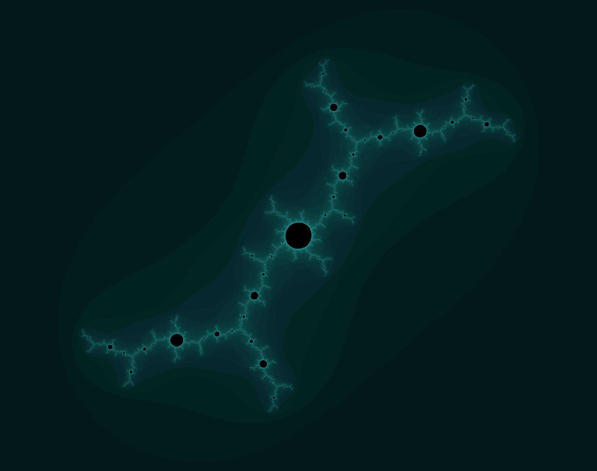

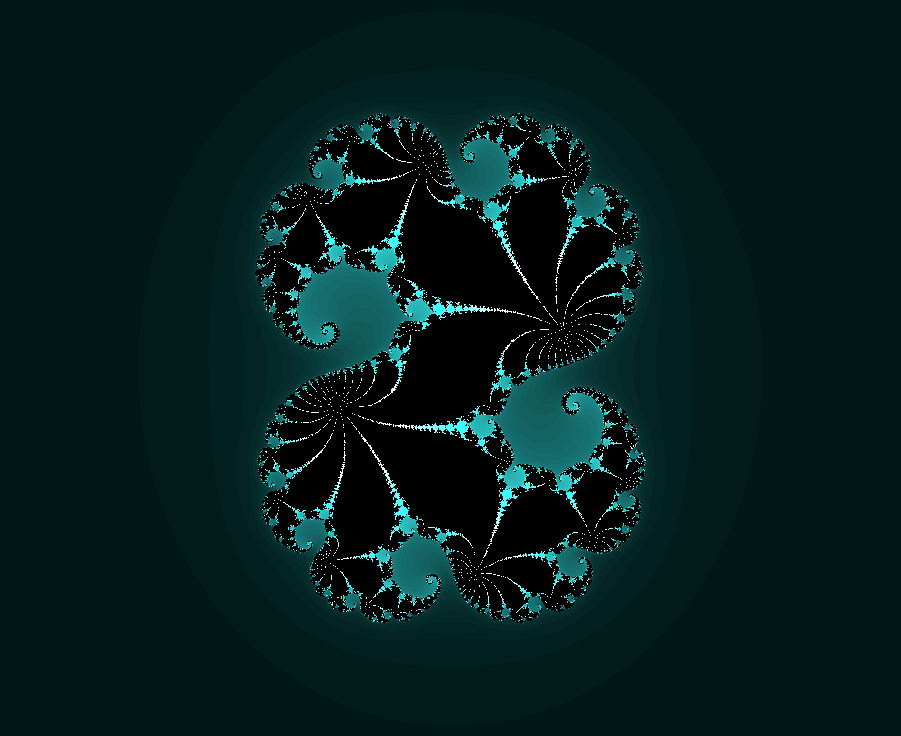

## About
Author : Alessandro Fraschetti (mail: [gos95@gommagomma.net](mailto:gos95@gommagomma.net))

