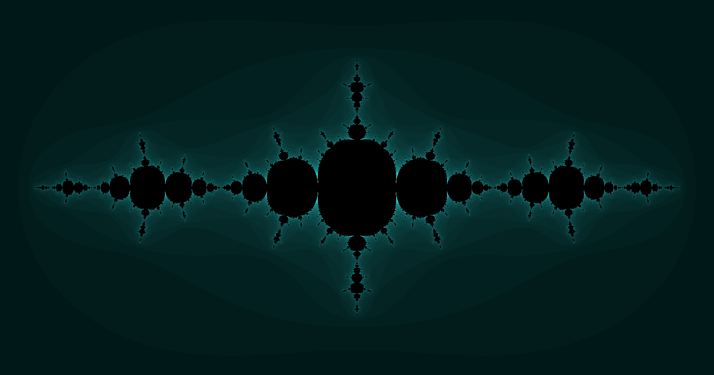
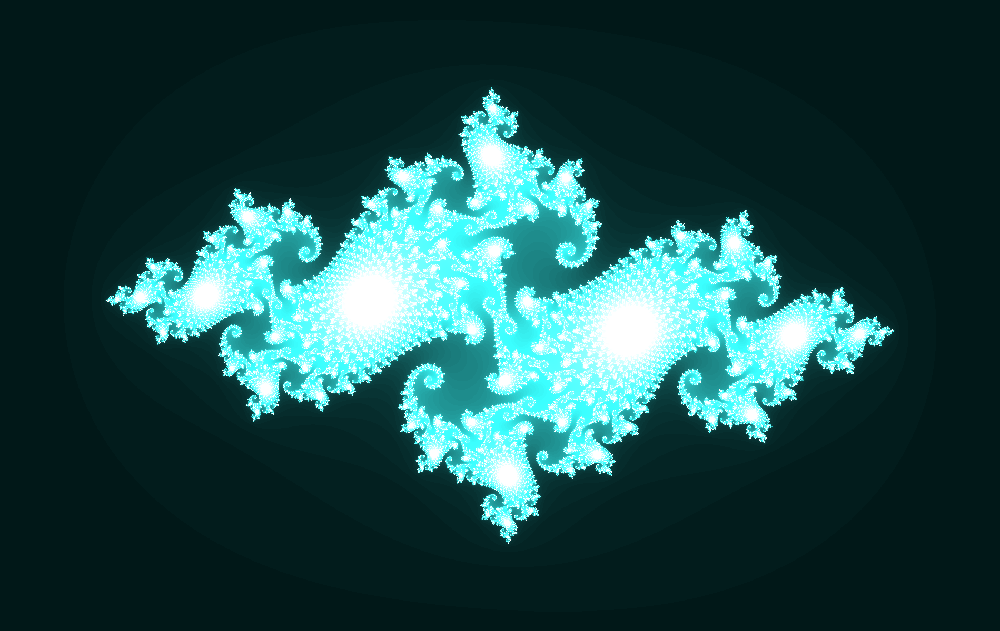
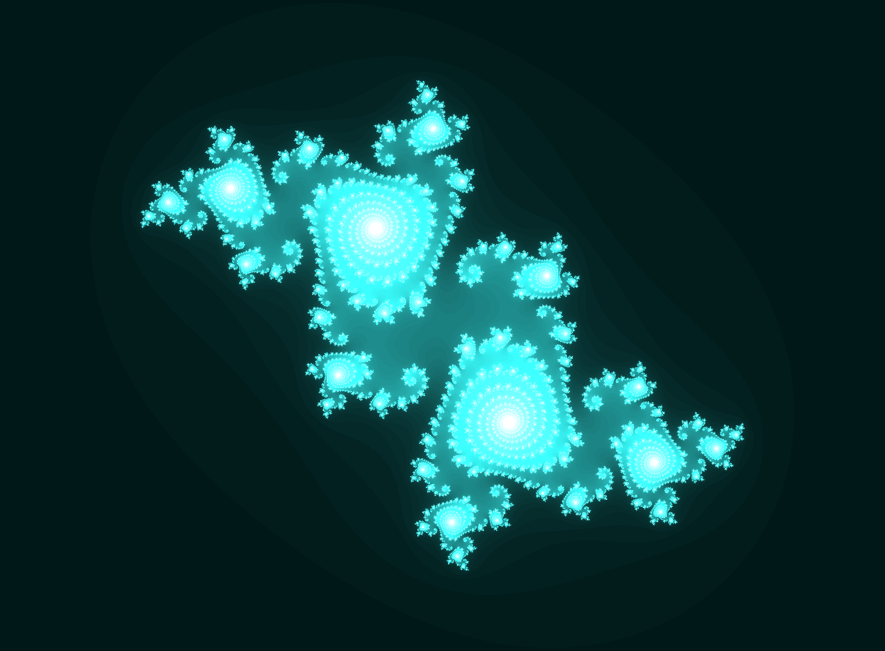
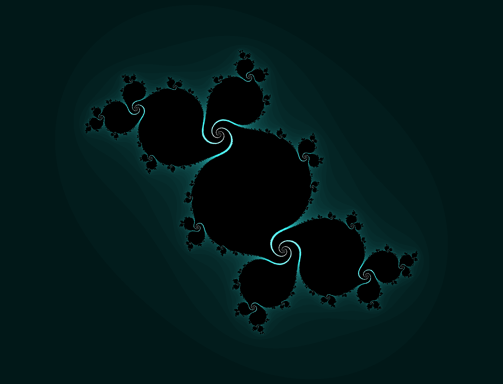
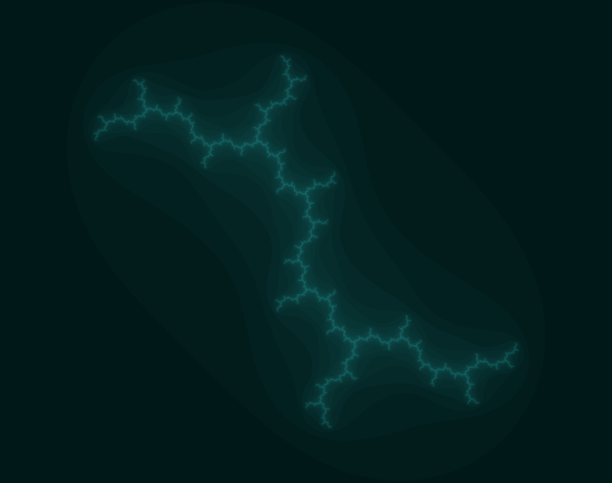

# Julia sets
When $c$ in $z_{n+1} = z_{n}^{2} + c$ is held constant at a specific value, the set corresponds to a Julia set.
Some of the interesting values of $c$ are as follow:

## Julia set: $c = -1.25$

##### Images:
- 1899x1000 pixels: [julia_1899_1000_949_500_0.002_[-1.25+0.0i]_372_2.png](julia-low-res/julia_1899_1000_949_500_0.002_[-1.25+0.0i]_372_2.png)
- 3799x2000 pixels: [julia_3799_2000_1899_1000_0.001_[-1.25+0.0i]_539_2.png](julia-mid-res/julia_3799_2000_1899_1000_0.001_[-1.25+0.0i]_539_2.png)
- 7599x4000 pixels: [julia_7599_4000_3799_2000_5.0E-4_[-1.25+0.0i]_739_2.png](julia-hi-res/julia_7599_4000_3799_2000_5.0E-4_[-1.25+0.0i]_739_2.png)
- 15199x8000 pixels: [julia_15199_8000_7599_4000_2.5E-4_[-1.25+0.0i]_929_2.png](julia-hi2-res/julia_15199_8000_7599_4000_2.5E-4_[-1.25+0.0i]_929_2.png)

##### Software parameters:
<pre>
Mandelbrot.delta = 0.0000001D;
Mandelbrot.MAXEMPTYIT = 100;
Mandelbrot.dX = 3.80;
Mandelbrot.X0=1.90;
Mandelbrot.dY = 2.0;
Mandelbrot.Y0 = 1.0;
</pre>

## Julia set: $c = -0.74543 + 0.11301i$

##### Images:
- 1899x1200 pixels: [julia_3799_2400_1899_1200_0.001_[-0.74543+0.11301i]_2091_2.png](julia-low-res/julia_1899_1200_949_600_0.002_[-0.74543+0.11301i]_1848_2.png)
- 3799x2400 pixels: [julia_3799_2400_1899_1200_0.001_[-0.74543+0.11301i]_2091_2.png](julia-mid-res/julia_3799_2400_1899_1200_0.001_[-0.74543+0.11301i]_2091_2.png)
- 7599x4800 pixels: [julia-hi-res/julia_7599_4800_3799_2400_5.0E-4_[-0.74543+0.11301i]_2091_2.png](julia-hi-res/julia_7599_4800_3799_2400_5.0E-4_[-0.74543+0.11301i]_2091_2.png)
- 15199x9600 pixels: [julia_15199_9600_7599_4800_2.5E-4_[-0.74543+0.11301i]_2405_2.png](julia-hi2-res/julia_15199_9600_7599_4800_2.5E-4_[-0.74543+0.11301i]_2405_2.png)

##### Software parameters:
<pre>
Mandelbrot.delta = 0.0000001D;
Mandelbrot.MAXEMPTYIT = 100;
Mandelbrot.dX = 3.80;
Mandelbrot.X0=1.90;
Mandelbrot.dY = 2.4;
Mandelbrot.Y0 = 1.2;
</pre>

## Julia set: $c = -0.194 + 0.6557i$

##### Images:
- 1899x1399 pixels: [julia_1899_1399_949_699_0.002_[-0.194+0.6557i]_735_2.png](julia-low-res/julia_1899_1399_949_699_0.002_[-0.194+0.6557i]_735_2.png)
- 3799x2799 pixels: [julia_3799_2799_1899_1399_0.001_[-0.194+0.6557i]_910_2.png](julia-mid-res/julia_3799_2799_1899_1399_0.001_[-0.194+0.6557i]_910_2.png)
- 7599x5599 pixels: [julia_7599_5599_3799_2799_5.0E-4_[-0.194+0.6557i]_1000_2.png](julia-hi-res/julia_7599_5599_3799_2799_5.0E-4_[-0.194+0.6557i]_1000_2.png)
- 15199x11199 pixels: [julia_15199_11199_7599_5599_2.5E-4_[-0.194+0.6557i]_1000_2.png](julia-hi2-res/julia_15199_11199_7599_5599_2.5E-4_[-0.194+0.6557i]_1000_2.png)

##### Software parameters:
<pre>
Mandelbrot.delta = 0.0000001D;
Mandelbrot.MAXEMPTYIT = 100;
Mandelbrot.dX = 3.80;
Mandelbrot.X0=1.90;
Mandelbrot.dY = 2.8;
Mandelbrot.Y0 = 1.4;
</pre>

# Julia set: $c = -0.11 + 0.6557i$

##### Images:
- 1899x1450 pixels: [julia_1899_1450_949_725_0.002_[-0.11+0.6557i]_732_2.png](julia-low-res/julia_1899_1450_949_725_0.002_[-0.11+0.6557i]_732_2.png)
- 3799x2900 pixels: [julia_3799_2900_1899_1450_0.001_[-0.11+0.6557i]_822_2.png](julia-mid-res/julia_3799_2900_1899_1450_0.001_[-0.11+0.6557i]_822_2.png)
- 7599x5800 pixels: [julia_7599_5800_3799_2900_5.0E-4_[-0.11+0.6557i]_930_2.png](julia-hi-res/julia_7599_5800_3799_2900_5.0E-4_[-0.11+0.6557i]_930_2.png)
- 15199x11600 pixels: [julia_15199_11600_7599_5800_2.5E-4_[-0.11+0.6557i]_505_2.png](julia-hi2-res/julia_15199_11600_7599_5800_2.5E-4_[-0.11+0.6557i]_505_2.png)

##### Software parameters:
<pre>
Mandelbrot.delta = 0.0000001D;
Mandelbrot.MAXEMPTYIT = 100;
Mandelbrot.dX = 3.80;
Mandelbrot.X0=1.90;
Mandelbrot.dY = 2.9;
Mandelbrot.Y0 = 1.45;
</pre>

# Julia set: $c = -0.12 + 0.74i$

##### Images:
- 1899x1450 pixels: [julia_1899_1450_949_725_0.002_[-0.12+0.74i]_188_2.png](julia-low-res/julia_1899_1450_949_725_0.002_[-0.12+0.74i]_188_2.png)
- 3799x2900 pixels: [julia_3799_2900_1899_1450_0.001_[-0.12+0.74i]_189_2.png](julia-mid-res/julia_3799_2900_1899_1450_0.001_[-0.12+0.74i]_189_2.png)
- 7599x5800 pixels: [julia_7599_5800_3799_2900_5.0E-4_[-0.12+0.74i]_237_2.png](julia-hi-res/julia_7599_5800_3799_2900_5.0E-4_[-0.12+0.74i]_237_2.png)
- 15199x11600 pixels: [julia_15199_11600_7599_5800_2.5E-4_[-0.12+0.74i]_90_2.png](julia-hi2-res/julia_15199_11600_7599_5800_2.5E-4_[-0.12+0.74i]_90_2.png)

##### Software parameters:
<pre>
Mandelbrot.delta = 0.0000001D;
Mandelbrot.MAXEMPTYIT = 100;
Mandelbrot.dX = 3.80;
Mandelbrot.X0=1.90;
Mandelbrot.dY = 2.9;
Mandelbrot.Y0 = 1.45;
</pre>

# Julia set: $c = -0.39054 - 0.58679i$

##### Images:
- 1899x1450 pixels: [julia_1899_1450_949_725_0.002_[-0.39054-0.58679i]_7973_2.png](julia-low-res/julia_1899_1450_949_725_0.002_[-0.39054-0.58679i]_7973_2.png)
- 3799x2900 pixels: [julia_3799_2900_1899_1450_0.001_[-0.39054-0.58679i]_10000_2.png](julia-mid-res/julia_3799_2900_1899_1450_0.001_[-0.39054-0.58679i]_10000_2.png)
- 7599x5800 pixels: [julia_7599_5800_3799_2900_5.0E-4_[-0.39054-0.58679i]_10000_2.png](julia-hi-res/julia_7599_5800_3799_2900_5.0E-4_[-0.39054-0.58679i]_10000_2.png)
- 15199x11600 pixels: [julia_15199_11600_7599_5800_2.5E-4_[-0.39054-0.58679i]_1475_2.png](julia-hi2-res/julia_15199_11600_7599_5800_2.5E-4_[-0.39054-0.58679i]_1475_2.png)

##### Software parameters:
<pre>
Mandelbrot.delta = 0.0000001D;
Mandelbrot.MAXEMPTYIT = 100;
Mandelbrot.dX = 3.80;
Mandelbrot.X0=1.90;
Mandelbrot.dY = 2.9;
Mandelbrot.Y0 = 1.45;
</pre>

# Julia set: $c = -0.481762 - 0.531657i$

##### Images:
- 1899x1450 pixels: [julia_1899_1450_949_725_0.002_[-0.481762-0.531657i]_1237_2.png](julia-low-res/julia_1899_1450_949_725_0.002_[-0.481762-0.531657i]_1237_2.png)
- 3799x2900 pixels: [julia_3799_2900_1899_1450_0.001_[-0.481762-0.531657i]_1292_2.png](julia-mid-res/julia_3799_2900_1899_1450_0.001_[-0.481762-0.531657i]_1292_2.png)
- 7599x5800 pixels: [julia_7599_5800_3799_2900_5.0E-4_[-0.481762-0.531657i]_2387_2.png](julia-hi-res/julia_7599_5800_3799_2900_5.0E-4_[-0.481762-0.531657i]_2387_2.png)
- 15199x11600 pixels: [julia_15199_11600_7599_5800_2.5E-4_[-0.481762-0.531657i]_430_2.png](julia-hi2-res/julia_15199_11600_7599_5800_2.5E-4_[-0.481762-0.531657i]_430_2.png)

##### Software parameters:
<pre>
Mandelbrot.delta = 0.0000001D;
Mandelbrot.MAXEMPTYIT = 100;
Mandelbrot.dX = 3.80;
Mandelbrot.X0=1.90;
Mandelbrot.dY = 2.9;
Mandelbrot.Y0 = 1.45;
</pre>

# Julia set: $c = i$

##### Images:
- 1899x1500 pixels: [julia_1899_1500_949_750_0.002_[0.0+1.0i]_153_2.png](julia-low-res/julia_1899_1500_949_750_0.002_[0.0+1.0i]_153_2.png)
- 3799x3000 pixels: [julia_3799_3000_1899_1500_0.001_[0.0+1.0i]_153_2.png](julia-mid-res/julia_3799_3000_1899_1500_0.001_[0.0+1.0i]_153_2.png)
- 7599x6000 pixels: [julia_7599_6000_3799_3000_5.0E-4_[0.0+1.0i]_153_2.png](julia-hi-res/julia_7599_6000_3799_3000_5.0E-4_[0.0+1.0i]_153_2.png)
- 15199x12000 pixels: [julia_15199_12000_7599_6000_2.5E-4_[0.0+1.0i]_156_2.png](julia-hi2-res/julia_15199_12000_7599_6000_2.5E-4_[0.0+1.0i]_156_2.png)

##### Software parameters:
<pre>
Mandelbrot.delta = 0.0000001D;
Mandelbrot.MAXEMPTYIT = 100;
Mandelbrot.dX = 3.80;
Mandelbrot.X0=1.90;
Mandelbrot.dY = 3.0;
Mandelbrot.Y0 = 1.5;
</pre>

# Julia set: $c = -0.11031 - 0.67037i$

##### Images:
- 1899x1500 pixels: [julia_1899_1500_949_750_0.002_[-0.11031-0.67037i]_335_2.png](julia-low-res/julia_1899_1500_949_750_0.002_[-0.11031-0.67037i]_335_2.png)
- 3799x3000 pixels: [julia_3799_3000_1899_1500_0.001_[-0.11031-0.67037i]_377_2.png](julia-mid-res/julia_3799_3000_1899_1500_0.001_[-0.11031-0.67037i]_377_2.png)
- 7599x6000 pixels: [julia_7599_6000_3799_3000_5.0E-4_[-0.11031-0.67037i]_377_2.png](julia-hi-res/julia_7599_6000_3799_3000_5.0E-4_[-0.11031-0.67037i]_377_2.png)
- 15199x12000 pixels: [julia_15199_12000_7599_6000_2.5E-4_[-0.11031-0.67037i]_189_2.png](julia-hi2-res/julia_15199_12000_7599_6000_2.5E-4_[-0.11031-0.67037i]_189_2.png)

##### Software parameters:
<pre>
Mandelbrot.delta = 0.0000001D;
Mandelbrot.MAXEMPTYIT = 100;
Mandelbrot.dX = 3.80;
Mandelbrot.X0=1.90;
Mandelbrot.dY = 3.0;
Mandelbrot.Y0 = 1.5;
</pre>

# Julia set: $c = -0.15652 - 1.03225i$

##### Images:
- 1899x1500 pixels: [julia_1899_1500_949_750_0.002_[-0.15652-1.03225i]_194_2.png](julia-low-res/julia_1899_1500_949_750_0.002_[-0.15652-1.03225i]_194_2.png)
- 3799x3000 pixels: [julia_3799_3000_1899_1500_0.001_[-0.15652-1.03225i]_195_2.png](julia-mid-res/julia_3799_3000_1899_1500_0.001_[-0.15652-1.03225i]_195_2.png)
- 7599x6000 pixels: [julia_7599_6000_3799_3000_5.0E-4_[-0.15652-1.03225i]_195_2.png](julia-hi-res/julia_7599_6000_3799_3000_5.0E-4_[-0.15652-1.03225i]_195_2.png)
- 15199x12000 pixels: [julia_15199_12000_7599_6000_2.5E-4_[-0.15652-1.03225i]_197_2.png](julia-hi2-res/julia_15199_12000_7599_6000_2.5E-4_[-0.15652-1.03225i]_197_2.png)

##### Software parameters:
<pre>
Mandelbrot.delta = 0.0000001D;
Mandelbrot.MAXEMPTYIT = 100;
Mandelbrot.dX = 3.80;
Mandelbrot.X0=1.90;
Mandelbrot.dY = 3.0;
Mandelbrot.Y0 = 1.5;
</pre>

# Julia set: $c = 0.31 + 0.04i$

##### Images:
- 1899x1550 pixels: [julia_1899_1550_949_775_0.002_[0.31+0.04i]_198_2.png](julia-low-res/julia_1899_1550_949_775_0.002_[0.31+0.04i]_198_2.png)
- 3799x3100 pixels: [julia_3799_3100_1899_1550_0.001_[0.31+0.04i]_210_2.png](julia-mid-res/julia_3799_3100_1899_1550_0.001_[0.31+0.04i]_210_2.png)
- 7599x6200 pixels: [julia_7599_6200_3799_3100_5.0E-4_[0.31+0.04i]_210_2.png](julia-hi-res/julia_7599_6200_3799_3100_5.0E-4_[0.31+0.04i]_210_2.png)
- 15199x12400 pixels: [julia_15199_12400_7599_6200_2.5E-4_[0.31+0.04i]_101_2.png](julia-hi2-res/julia_15199_12400_7599_6200_2.5E-4_[0.31+0.04i]_101_2.png)

##### Software parameters:
<pre>
Mandelbrot.delta = 0.0000001D;
Mandelbrot.MAXEMPTYIT = 100;
Mandelbrot.dX = 3.80;
Mandelbrot.X0=1.90;
Mandelbrot.dY = 3.1;
Mandelbrot.Y0 = 1.55;
</pre>

# Julia set: $c = 0.27334 + 0.00742i$

##### Images:
- 1899x1550 pixels: [julia_1899_1550_949_775_0.002_[0.27334+0.00742i]_3066_2.png](julia-low-res/julia_1899_1550_949_775_0.002_[0.27334+0.00742i]_3066_2.png)
- 3799x3100 pixels: [julia_3799_3100_1899_1550_0.001_[0.27334+0.00742i]_3702_2.png](julia-mid-res/julia_3799_3100_1899_1550_0.001_[0.27334+0.00742i]_3702_2.png)
- 7599x6200 pixels: [julia_7599_6200_3799_3100_5.0E-4_[0.27334+0.00742i]_4799_2.png](julia-hi-res/julia_7599_6200_3799_3100_5.0E-4_[0.27334+0.00742i]_4799_2.png)
- 15199x12400 pixels: [julia_15199_12400_7599_6200_2.5E-4_[0.27334+0.00742i]_2054_2.png](julia-hi2-res/julia_15199_12400_7599_6200_2.5E-4_[0.27334+0.00742i]_2054_2.png)

##### Software parameters:
<pre>
Mandelbrot.delta = 0.0000001D;
Mandelbrot.MAXEMPTYIT = 100;
Mandelbrot.dX = 3.80;
Mandelbrot.X0=1.90;
Mandelbrot.dY = 3.1;
Mandelbrot.Y0 = 1.55;
</pre>
