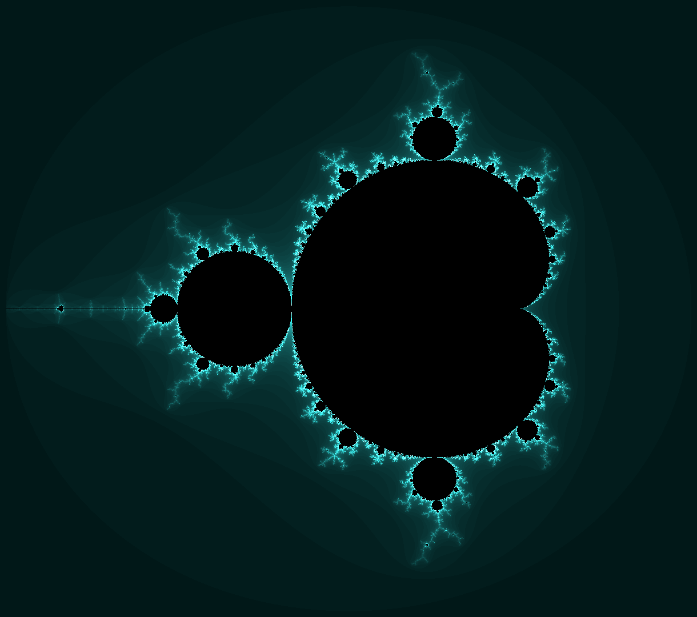

# Mandelbrot set
The mandelbrot set is the set of complex numbers $z$ for which the series $z_{n+1} = z_{n}^{2} + c$ does not diverge to infinity.

## Images:
- 1524x1350 pixels: [mandelbrot_1524_1350_1012_675_0.002_[null]_4417_2.png](mandelbrot/mandelbrot_1524_1350_1012_675_0.002_[null]_4417_2.png)
- 3049x2700 pixels: [mandelbrot_3049_2700_2024_1350_0.001_[null]_7080_2.png](mandelbrot/mandelbrot_3049_2700_2024_1350_0.001_[null]_7080_2.png)
- 6099x5400 pixels: [mandelbrot_6099_5400_4049_2700_5.0E-4_[null]_10000_2.png](mandelbrot/mandelbrot_6099_5400_4049_2700_5.0E-4_[null]_10000_2.png)
- 15249x13500 pixels: [mandelbrot_15249_13500_10124_6750_2.0E-4_[null]_2754_2.png](mandelbrot/mandelbrot_15249_13500_10124_6750_2.0E-4_[null]_2754_2.png)
- 20000x16000 pixels: [mandelbrot_20000_16000_14000_8000_1.5E-4_450_1.png](mandelbrot/mandelbrot_20000_16000_14000_8000_1.5E-4_450_1.png)
- 27727x24545 pixels: [mandelbrot_27727_24545_18409_12272_1.1E-4_[null]_3285_2.png](mandelbrot/mandelbrot_27727_24545_18409_12272_1.1E-4_[null]_3285_2.png)

## Software parameters:
<pre>
Mandelbrot.delta = 0.0000001D;
Mandelbrot.MAXEMPTYIT= 100;
Mandelbrot.dX = 3.05;
Mandelbrot.X0=2.025;
Mandelbrot.dY = 2.7;
Mandelbrot.Y0 = 1.35;
</pre>
